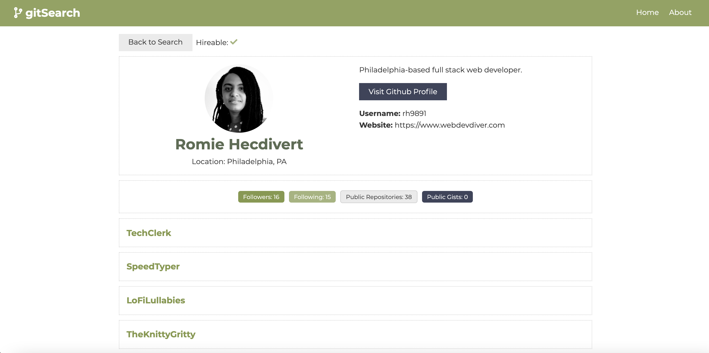

# gitSearch

[](https://opensource.org/licenses/MIT)

## Table of Contents

- [Description](#description)
- [User Story](#user-story)
- [Features of the Application](#features-of-the-application)
- [Preview of gitSearch](#preview-of-gitsearch)
- [Links](#links)
- [Installation](#installation)
- [Usage](#usage)
- [Built Using](#built-using)
- [License](#license)
- [Contributing](#contributing)
- [Questions](#questions)

## Description

gitSearch is a responsive, dynamic application that searches for Github users through an input form. Upon a user's search, the application generates a list of all the Github users matching the inputted term onto a grid format. Clicking on the `More` button allows the user access to additional Github information for that searched user, such as their bio, website, location, five most recent repositories, their Github profile page, among other things.

gitSearch is a React application that utilizes the Context API along with the useContext and useReducer hooks for state management. The application also utilizes the Github API to search for Github users by their username and name to display the user's profile and other relevant information.

Since this application was created, Github made changes to their authentication process via URL query parameters. Because of this, an access token was created (with no permissions) and utilized in the application. The code was also refactored to have less actions and reducers and reduce code while producing the same functionality as before.

## User Story

```
AS A user
I WANT to search for Github users
SO THAT I can access their bios, repositories, and other relevant information.
```

## Features of the Application

```
GIVEN a search-based application
WHEN I input a term to find a Github user and click on `Search`
THEN all users matching that search term will be displayed in a grid format.

WHEN I click on `More` (under the user's profile picture)
THEN I will access that user's name, username, bio, website, location, five most recent repositories, and other relevant information.

WHEN I click on `Visit Github Profile` (beneath the user's bio)
THEN I will access that user's Github profile page via Github.

WHEN I click on any of the displayed repository names
THEN I will be taken to that repository's Github page.

WHEN I click on `Back to Search`
THEN I will taken back to the search page.

WHEN I click on `Clear` (beneath the Search button)
THEN I will have cleared the results of the current search.
```

## Preview of gitSearch



## Links

- [Deployed Application](https://find-users-on-github.netlify.app/)

- [Github Repository](https://github.com/rh9891/gitSearch)

## Installation

The application requires the following dependencies and/or package managers:

```
$ npm install axios react react-router-dom
```

When downloaded, the application requires the input of `npm install` into the command line interface in order to download the contents of the `package.json`.

## Usage

The application can be initiated by inputting `npm start` into the command line interface and running the application on `localhost: 3000`.

## Built Using

Listed below are the frameworks, libraries, and guides that made building this application possible:

- [Context](https://reactjs.org/docs/context.html)
- [Github REST API](https://docs.github.com/en/rest/overview)
- [React](https://reactjs.org/docs/getting-started.html)
- [Traversy Media Tutorials](https://www.traversymedia.com/)

## License

The MIT License (MIT)

Copyright (c) 2020-2021 Romie Hecdivert

Permission is hereby granted, free of charge, to any person obtaining a copy of this software and associated documentation files (the "Software"), to deal in the Software without restriction, including without limitation the rights to use, copy, modify, merge, publish, distribute, sublicense, and/or sell copies of the Software, and to permit persons to whom the Software is furnished to do so, subject to the following conditions:

The above copyright notice and this permission notice shall be included in all copies or substantial portions of the Software.

THE SOFTWARE IS PROVIDED "AS IS", WITHOUT WARRANTY OF ANY KIND, EXPRESS OR IMPLIED, INCLUDING BUT NOT LIMITED TO THE WARRANTIES OF MERCHANTABILITY, FITNESS FOR A PARTICULAR PURPOSE AND NONINFRINGEMENT. IN NO EVENT SHALL THE AUTHORS OR COPYRIGHT HOLDERS BE LIABLE FOR ANY CLAIM, DAMAGES OR OTHER LIABILITY, WHETHER IN AN ACTION OF CONTRACT, TORT OR OTHERWISE, ARISING FROM, OUT OF OR IN CONNECTION WITH THE SOFTWARE OR THE USE OR OTHER DEALINGS IN THE SOFTWARE.

## Contributing

If you would like to contribute to this repository, please contact me via [Github](https://github.com/rh9891).

## Questions

If you have any questions, comments, or issues regarding this application, please do not hesitate to contact me via [Github](https://github.com/rh9891).
